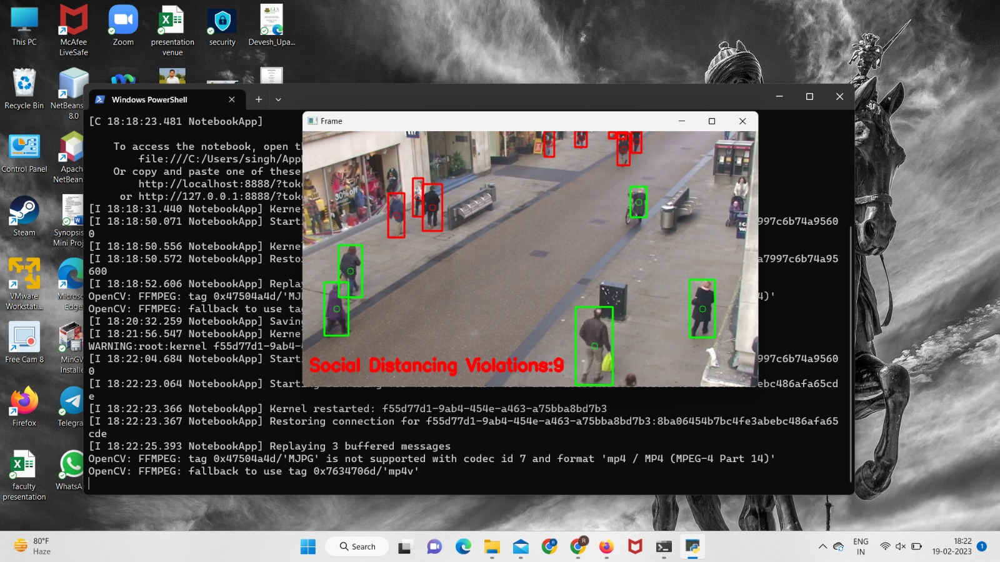
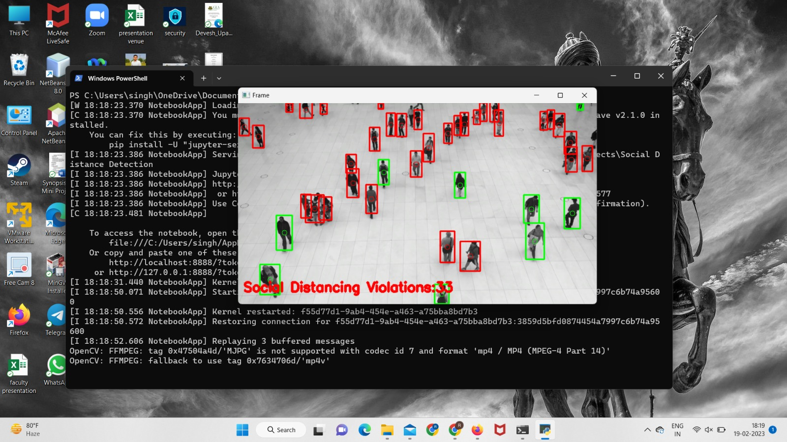

# SOCIAL DISTANCING DETECTION

# About -

It is a team project. Me and my team members worked on Machine Learning/OpenCV together 
to work on this during our internship with ineuron.
### Algorithm used - YOLO Algorithm
### Object Detection 

# Technologies used - 

## Libraries used - 
### SciPy
### OS
### Argparse
### imUtils
### OpenCV2

# Output of an an video

https://user-images.githubusercontent.com/73637184/220821875-182782be-7955-449d-bc7b-389e9d8ea8f1.mp4

